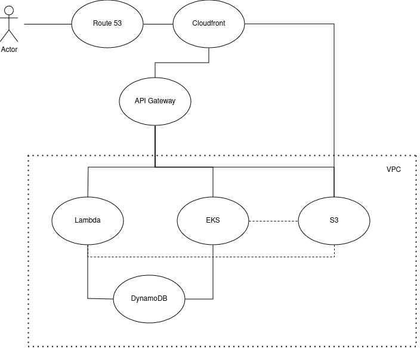

# E-Commerce Architecture

## Penjesalan Arsitektur
### Route 53
service ini digunakan untuk me manage DNS dari sistem yang kita miliki dan bisa di attach policy yang berkaitan dengan jumlah request client, latency, geolokasi, dan failover jika IP sistem mengalami gangguan.
### Cloudfront
cloudfront disini sebagai cache system, karena konten pada ecommerce terutama gambar yang biasanya berulang, jika tidak tercache maka akan mengambil konten dari service yang berhubungan, baik itu S3 atau Request lagi dari API Gateway. Cloudfront ini juga bisa dibilang sebagai security layer juga karena punya DDoS protection, HTTS support, WAF.
### API Gateway
Service ini sebagai pemeta utama terhadap service, fungsi utamanya untuk memantau traffic dari client serta, meneruskannya ke service lain yang sesuai, baik itu dari endpointnya ataupun dari ketersediaanya. API gateway ini juga bisa digunakan sebagai cache jika ada beberapa konten yang biasa diakses sehingga dapat menambah kecepatan ketika akses suatu konten
### AWS Lambda
Lambda disini digunakan sebagai salah satu logic utama dan tempat dari software berada. AWS lambda dapat menjalankan fungsi" yg membutuhkan kecepatan seperti perhitungan stok produk yang tersedia, checkout, dsb. AWS lambda juga bisa autoscale ketika memang diperlukan sehingga proses" seperti ini dapat dilakukan oleh banyak instance tanpa perlu melakukan setting tambahan
### EKS
EKS disini berfungsi mirip dengan aws lambda, namun ditujukan untuk process" yang memerlukan komputasi cukup lama seperti upload image, review produk, dsb. EKS disini juga bisa auto scale tergantung kebutuhan dari sistem. AWS lambda ataupun EKS masih bisa berinteraksi dengan S3 untuk file modification jika memang diperlukan
### DynamoDB
disini saya memilih DynamoDB karena dari segi jenis database lebih cepat jika dibandingkan relational database, juga lebih murah dari segi cost.
### VPC
VPC disini sebagai extra layer security agar sistem yang berjalan tidak bisa diakses oleh orang luar yang otomatis membuat sistem lebih aman.
## Tambahan
Ada beberapa tambahan yang dapat ditambahkan pada sistem yang telah dibuat diatas, seperti Global Accelerator untuk mempercepat akses dari luar wilayah, OpenSearch untuk memudahkan proses pencarian dari user, ElasticCache untuk cache yang berkaitan dengan database, SNS untuk notification, dsb. namun tidak dimasukan karena kurangnya pemahaman saya terhadap service ini.

Penggaksesan setiap service pun harus diperhatikan dengan cara membuat IAM user yang cocok policynya agar lebih aman dan mudah untuk di manage
