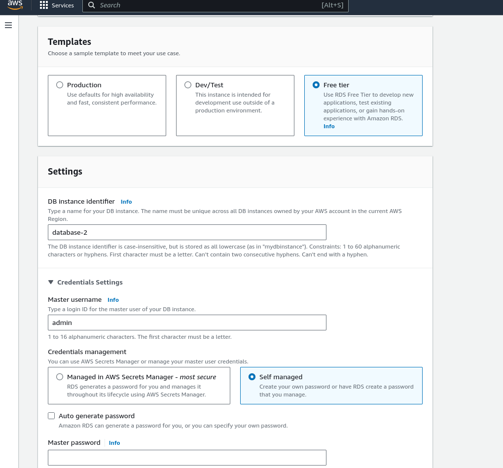

#RDS Setup
## from console
Masuk ke aws console dan cari menu RDS -> databases -> create database
> Ada beberapa konfigurasi yang harus diperhatikan pada pembuatan rds ini
### Pilih Jenis database
Pada tahap ini saya menggunakan standart create agar konfigurasi lebih banyak, serta memilih mariaDB

### Pilih template dan setting master user
Pilih template yang akan digunakan, saya disini memilih free tier untuk test saja
lalu buat username dan master password.
> Untuk kebutuhan testing, password tidak perlu auto-generated dan buat password yang bisa diingat

### Konfigurasi lain
Selanjutnya ada beberapa konfigurasi seperti network, connect to EC2, dsb yang bisa disesuaikan kepada kebutuhan penggunaan
yang mau saya highlight disini adalah konfigurasi public access yang disetting ke **yes** agar bisa diakses dari luar

setelah seluruh setting selesai diisi, maka tinggal click *create database* dan tunggu hingga instance database *available*

## from AWS CLI
Untuk setup menggunakan AWS CLI, kita harus setup aws cli pada komputer kita, dan configurasi sesuai dengan arahan dari aws. yang dapat diakses di [sini](https://docs.aws.amazon.com/cli/latest/userguide/getting-started-quickstart.html)
Setelah melakukan setup, tinggal jalankan script dibawah ini yang kurang lebih sama dengan cara console diatas
`
aws rds create-db-instance \
    --db-instance-identifier mariadb-instance \
    --engine mariadb \
    --db-instance-class db.t3.micro \
    --allocated-storage 20 \
    --master-username admin \
    --master-user-password yourpassword \
    --db-name mydatabase \
    --publicly-accessible
`
Kita bisa melihat port, user, dengan menggunakan command dibawah
`
aws rds describe-db-instances --query "*[].[DBInstanceIdentifier,Endpoint.Address,Endpoint.Port,MasterUsername]"
`
## Percobaan connet ke rds
Secara sederhana, kita bisa connect ke rds yang telah jalan dengan kode template seperti dibawah ini, lalu masukan password
`
mysql -h hostname -P port -u user -p
`
- hostname dapat dilihat di console rds
- port diisi dgn 3306 (default) atau port lain sesuai setup
- user adalah master username tadi

Sayangnya, percobaan saya dengan code diatas sesuai yang saya setup selalu gagal, entah kenapa mungkin ada permasalahan dgn setting networknya
`
mysql -h database-1.cb2g602qg9ix.us-east-1.rds.amazonaws.com -P 3306 -u admin -p
`

seperti contoh gambar diatas, lalu akan menampilkan error

padahal sudah ada instance yang berjalan, mungkin perlu ada riset lebih jauh agar bisa menyelesaikan masalah ini.